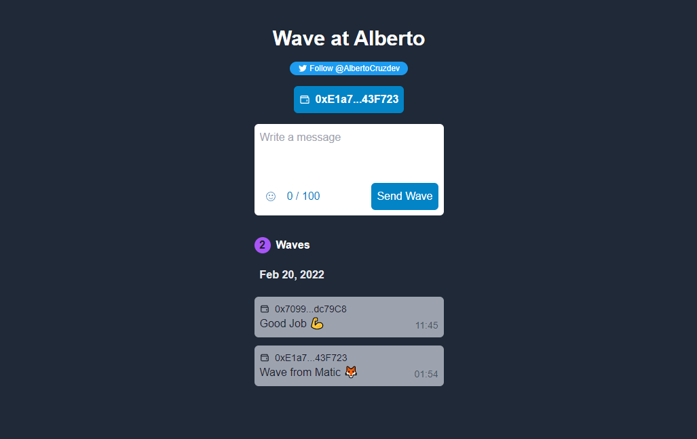

<h1 align="center">Welcome to WavePortalWeb3 👋</h1>
<p>
  
  <a href="https://twitter.com/AlbertoCruzdev" target="_blank">
    
  </a>
</p>

> Web3 Dapp build with Nextjs and TailwindCSS. Course of Build a Web3 App with Solidity + Ethereum Smart Contracts.



### ✨ [Demo](https://waveportalweb3.vercel.app/)

## Install

```sh
npm install
```

## Usage

```sh
npm run dev
```

## Tools
- [NextJS](https://nextjs.org/)
- [TailwindCss](https://tailwindcss.com/)
- [Thirdweb](https://thirdweb.com/)

## Author

👤 **Alberto Cruz Luis**

* Website: albertocruzluis.com
* Twitter: [@AlbertoCruzdev](https://twitter.com/AlbertoCruzdev)
* Github: [@AlbertoCruzLuis](https://github.com/AlbertoCruzLuis)
* LinkedIn: [@albertocruzluis](https://linkedin.com/in/albertocruzluis)

## Show your support

Give a ⭐️ if this project helped you!

***
_This README was generated with ❤️ by [readme-md-generator](https://github.com/kefranabg/readme-md-generator)_